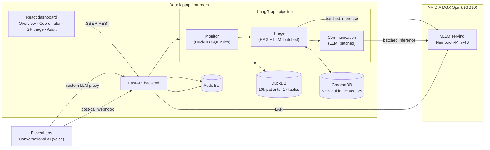
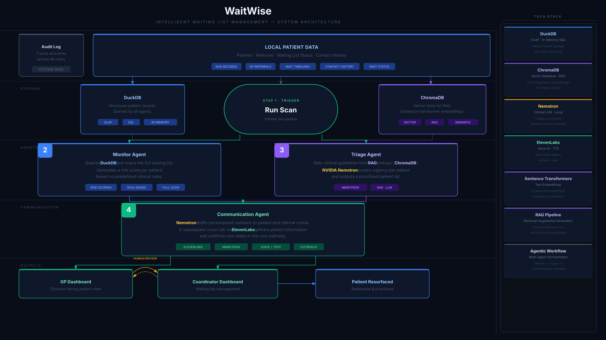

# WaitWise - NVIDIA London Hack for Impact Winners 2026

**An agentic coordination layer for NHS elective waiting lists. It reads an entire waiting list, finds the patients slipping through coordination gaps, triages them on a locally-hosted NVIDIA Nemotron model, drafts clinician-ready referrals, and even phones patients with an autonomous voice agent — all on a DGX Spark, with zero patient data leaving the device.**

NVIDIA Hack For Impact · London Tech Week 2026 · Track: **Public Services** - Winneer of Eleven Labs Bounty and Public Services Track

https://github.com/user-attachments/assets/9ca24dfe-ee13-4a11-875f-9602ba21a764

---

## The problem

As of March 2026, **7.11 million** people are on the NHS RTT waiting list; only **65.3%** are seen within 18 weeks against a 92% constitutional standard, and people in the most deprived areas are **2× more likely** to wait over a year. Current tools clean and validate lists but do not continuously surface the patients quietly falling through the cracks: the 52‑week breaches never contacted, the pathway changes never reassessed, the deprived patients going silent. WaitWise is that missing coordination layer.

## What it does (the core loop)

1. **Monitor** (CPU SQL, no AI) scans all **10,003** patients and flags the **~1,240** at risk on auditable rules (wait length, RTT 18/52‑week breaches, deprivation, no‑contact, pathway changes).
2. **Triage** (RAG + Nemotron) pulls relevant NHS guidance from a vector store, then batch‑assesses the highest‑priority patients on the DGX Spark, producing a risk level, score, reason and recommended action.
3. **Communication** (Nemotron) drafts a structured **referral memo** and a compassionate **patient letter** for the high‑risk cohort.
4. A **coordinator** reviews each case and approves or **escalates to a GP**; the GP triage queue lets a clinician accept/action and note back. Every action is written to an **audit trail**.
5. An autonomous **voice check‑in agent** (Nemotron + ElevenLabs) phones voice‑suitable patients to validate they still need care and detect deterioration, logging outcomes to the same audit trail.

Everything runs locally: the model on the DGX Spark, the data in‑process. No cloud LLM, no data egress.

## Architecture



**Three hops for inference:** browser → backend (laptop) → Nemotron (DGX Spark). The backend does the cheap work (SQL, RAG retrieval, orchestration) and sends only the reasoning to the Spark.

## Tech stack

| Layer | Tech |
|---|---|
| Model | **NVIDIA Nemotron‑Mini‑4B‑Instruct** served via **vLLM** on the **DGX Spark (GB10)** |
| Orchestration | LangGraph (Monitor → Triage → Communication agents) |
| Backend | FastAPI, SSE streaming, DuckDB (relational), ChromaDB + `all‑MiniLM‑L6‑v2` (RAG) |
| GPU telemetry | Live scrape of vLLM `/metrics` (+ `pynvml`/`nvidia‑smi` when run on the Spark) |
| Voice | ElevenLabs Conversational AI (TTS + ASR) with Nemotron as the custom LLM |
| Frontend | React + Vite + Tailwind (NHS‑styled) |

---



---

## Quick start

### Prerequisites
- Python 3.12 + the backend venv (`pip install -r requirements.txt`), Node 18+ for the frontend.
- A DGX Spark serving Nemotron via vLLM **(optional — a deterministic mock runs the whole app with no GPU).**

### Option 1 — Local, no GPU (mock model)
```bash
# Backend
cd waitwise-backend
WAITWISE_LLM=mock python -m uvicorn api:app --port 8080

# Frontend (separate terminal)
cd waitwise-frontend
npm install && npm run dev      # http://localhost:5173
```
Open the app, go to **Coordinator**, press **Start scan**. Completes in ~4s.

### Option 2 — Real Nemotron on the DGX Spark
```bash
# On the DGX (leave running):
source ~/vllm-env/bin/activate
vllm serve nvidia/Nemotron-Mini-4B-Instruct --port 8000 --host 0.0.0.0

# Backend on your machine:
cd waitwise-backend
python ingest.py

export MOCK_LLM=false
export VLLM_BASE_URL=http://<DGX-IP>:8000/v1
export VLLM_MODEL=nvidia/Nemotron-Mini-4B-Instruct
export WAITWISE_TRIAGE_HIGH_CAP=20 WAITWISE_TRIAGE_MEDIUM_CAP=5 WAITWISE_COMMS_CAP=5   # demo caps (~30-40s scans)
python -m uvicorn api:app --port 8080

# Frontend:
cd waitwise-frontend && npm run dev
```

### Environment variables (sample `.env`)
```bash
MOCK_LLM=false                                   # false = use Nemotron; unset/true = mock
VLLM_BASE_URL=http://10.18.216.10:8000/v1        # the DGX vLLM endpoint
VLLM_MODEL=nvidia/Nemotron-Mini-4B-Instruct
WAITWISE_TRIAGE_HIGH_CAP=20                       # high-risk patients triaged live (0 = all)
WAITWISE_TRIAGE_MEDIUM_CAP=5                      # medium-risk triaged live
WAITWISE_COMMS_CAP=5                              # high-risk letters drafted live (0 = all)
WAITWISE_MAX_CONCURRENCY=16                       # parallel requests (drives the GPU spike)
WAITWISE_PROXY_MAX_TOKENS=512                     # caps output for the voice-agent LLM proxy
```
First run rebuilds the DB/vectors if needed: `python ingest.py` (loads the CSVs into DuckDB + embeds the NHS guidance into ChromaDB).

### The voice agent (ElevenLabs + Nemotron)
See [`waitwise-backend`](waitwise-backend/) endpoints `/voice/next-patient`, `/voice/postcall`, `/voice/session-log` and the in‑repo setup notes. In short: an ElevenLabs Conversational AI agent uses the backend's `/v1` proxy as its **custom LLM** (which forwards to Nemotron over the LAN), and a **post‑call webhook** logs every finished call to the audit trail. Reliable on a 4B model because it needs no in‑call tool calling.

---

## Data & provenance

All data is **synthetic** — no real patient information. The `waitwise-backend/data/` directory holds **17 CSV tables / ~10,003 patients** modelling the real NHS structure: the two‑queue e‑RS → PTL pathway, RTT 18/52‑week clocks, IMD deprivation quintiles, London borough deprivation/wellbeing, pathway events (referrals, pathway changes, DNAs), contact history, and a 12‑doc NHS guidance corpus for RAG. It was engineered to reproduce realistic distributions (1,240 flagged, 302 high‑risk band, 5,482 never contacted, 5,344 voice‑suitable) plus planted edge cases and three "hero" patients for the demo. Statistics quoted in the UI (7.11M waiting, 65.3% within 18 weeks, 2× deprivation gap) are from NHS England / ONS / King's Fund and cited in‑app.

## Data grounding uses six open datasets:
From the City of London: 
- Patients Registered at a GP Practice (population denominators and GP access baseline by borough)
- the London Health Inequalities Strategic Indicators (deprivation, health outcome, and inequality metrics for borough-level risk stratification). 

From Office of National Statistics (ONS): 
- The NHS Community Health Survey Experiences Thematic Analysis, 
- NHS Hospital Waiting Experience Survey (Jan–Mar 2025, n=11,890), 
- Personal Wellbeing by Borough, and Non-Seasonally Adjusted Quarterly Estimates of Personal Wellbeing

Supporting datasets used to calibrate coordination failure thresholds, set patient experience distributions, and quantify the wellbeing-to-workforce-inactivity economic chain that connects this project to the Economic Systems track alongside Public Services.

## Why the DGX Spark (GB10)

- **Privacy by design.** NHS patient data is processed entirely on‑device; nothing is sent to a cloud LLM. This is the only way the data‑governance argument (DPA 2018, Caldicott, DSP Toolkit) holds.
- **Unified memory.** The 128 GB unified memory co‑hosts the Nemotron model, the sentence‑transformer embedder and the cohort/RAG context together.
- **Batched throughput.** vLLM continuous batching turns a per‑patient loop into a cohort pipeline: measured **~27 tok/s single‑stream → ~393 tok/s at 16 concurrent (≈14×)**, ~3.7 patients/s. The live GPU‑utilisation panel is scraped straight from the Spark.

## Known limitations & next steps

- **Demo caps.** By default only the top ~25 patients are triaged live for speed; the full 1,240 cohort is flagged but queued. Raise the `*_CAP` env vars (or set to 0) for full coverage at the cost of time.
- **Small‑model context.** Nemotron‑Mini‑4B has a 4,096‑token window and unreliable structured/multi‑tool output, so the voice agent uses a post‑call webhook rather than in‑call tool calling.
- **GPU telemetry.** When the backend runs on the laptop, the panel scrapes vLLM `/metrics` for real DGX activity; running the backend on the Spark itself gives true `pynvml` device utilisation.
- **Escalation queue** is in‑session app state (not yet persisted); the **audit trail** is in‑memory + JSONL.
- **Real deployment** would integrate via NHS e‑RS / GP Connect FHIR APIs and trust PTL warehouses, under DCB0129/0160, DTAC and DSPT — WaitWise is designed as a read‑and‑recommend overlay, never an automated decision‑maker.
- **Roadmap:** NIM serving + a larger Nemotron for the unified‑memory story, NeMo Retriever reranking, persisted escalation/audit, richer RTT rules, and a borough‑level analytics panel.

## Repo layout
```
waitwise-backend/    FastAPI + LangGraph pipeline, DuckDB, ChromaDB, voice endpoints, data/
waitwise-frontend/   React dashboard (Overview / Coordinator / GP triage / Audit trail)
```

> Clinician‑in‑the‑loop by design: WaitWise surfaces recommendations for human review and approval — it does not make clinical decisions.
